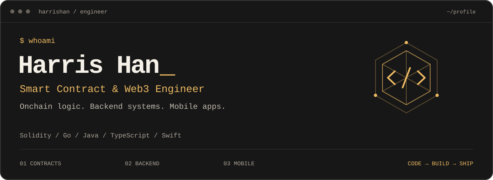

  

  <a href="https://harrishan.github.io">Website</a> &nbsp; / &nbsp;
  <a href="https://twitter.com/HarrisHan">X / Twitter</a> &nbsp; / &nbsp;
  <a href="https://github.com/HarrisHan?tab=repositories">All repositories ↗</a>

I build across **AI tooling, Web3, and mobile** — from agent skills and developer workflows to Solidity contracts and native iOS interfaces.

### Selected work

<table>
<tr>
<td width="50%" valign="top">
<h3><a href="https://github.com/HarrisHan/ai-daily-digest">AI Daily Digest ↗</a></h3>

An agent-native workflow that turns 92 curated tech blogs into a daily AI digest.

<code>JavaScript</code> <code>Agent skills</code> <code>RSS</code>

</td>
<td width="50%" valign="top">
<h3><a href="https://github.com/HarrisHan/8bitdo-micro-karabiner">A gamepad for AI work ↗</a></h3>

Turning the 8BitDo Micro into a Mac productivity pad for dictation, Claude Code, and terminal navigation.

<code>macOS</code> <code>Karabiner</code> <code>Workflow</code>

</td>
</tr>
<tr>
<td width="50%" valign="top">
<h3><a href="https://github.com/HarrisHan/safe-whitelist-guard">Safe Whitelist Guard ↗</a></h3>

A per-Safe recipient whitelist for outgoing transfers, with ERC20 calldata decoding. Designed for X Layer.

<code>Solidity</code> <code>Safe</code> <code>X Layer</code>

</td>
<td width="50%" valign="top">
<h3><a href="https://github.com/HarrisHan/Snapseed">Snapseed-style controls ↗</a></h3>

A lightweight Swift view inspired by Snapseed’s photo-filter parameter controls.

<code>Swift</code> <code>iOS</code> <code>UI component</code>

</td>
</tr>
</table>

Also exploring: [Web3 Daily Digest](https://github.com/HarrisHan/web3-daily-digest) · [ClawBox](https://github.com/HarrisHan/clawbox) · [vAMM Perpetual DEX](https://github.com/HarrisHan/vamm-perp-dex)

### Toolbox

| Area | Technologies |
| :--- | :--- |
| **Onchain** | Solidity · Ethereum · Solana · BNB Chain · Ethers.js · Hardhat |
| **Mobile** | Swift · iOS · Flutter · Dart |
| **Applications** | TypeScript · React · Next.js · Node.js · Go · Java · Rust |
| **Infrastructure** | PostgreSQL · Redis · Docker · AWS |

### A little every day

<picture>
  <source media="(prefers-color-scheme: dark)" srcset="https://raw.githubusercontent.com/HarrisHan/HarrisHan/output/github-snake-dark.svg" />
  <source media="(prefers-color-scheme: light)" srcset="https://raw.githubusercontent.com/HarrisHan/HarrisHan/output/github-snake.svg" />
  
</picture>

---

<samp>func ☕️() → 📱 { defer { 😴 } }</samp>

